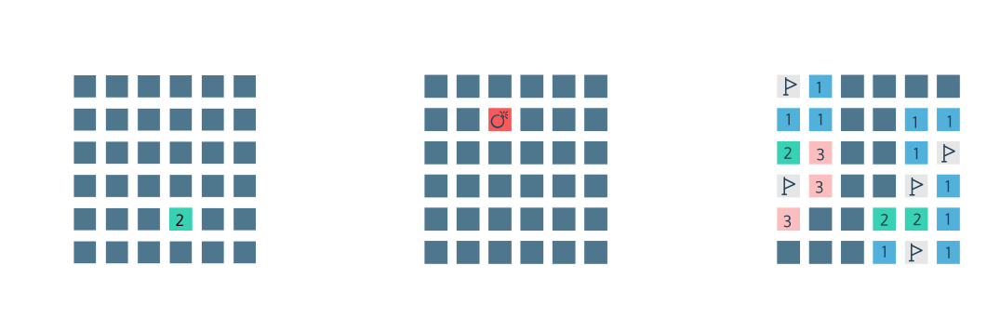

# Minesweeper

A terminal-based version of the classic computer game: <a href="https://en.wikipedia.org/wiki/Minesweeper_(video_game)">Minesweeper</a>.

- The objective is to successfully navigate (or, "clear") a grid of squares without encountering any hidden mines (bombs).

- Clicking on a square reveals what is underneath the square.

- If a square reveals a mine, the game is over, and you lose.

- If a square does _not_ reveal a mine, one of two possible things can happen:

  - A digit will appear in the square. This digit represents the number of adjacent squares that contain a mine.

  - Nothing will appear in the square. In this case, the square will clear and become blank. Adjacent squares will then be recursively revealed.

